# Kasuku 🦜


- An ASR project for non standard Kenyan speech that uses finetunned whisper models to understand non standard Kenyan speech

- A simple and powerful speech transcription application designed for non-standard speech patterns. The Kasuku webapp helps you convert audio recordings into text with support for English and Swahili.

# Technology Stack

| Category | Technologies |
| :--- | :--- |
| **Framework** | [](https://pytorch.org) [](https://streamlit.io) [](https://huggingface.co/transformers) |
| **Language** | [](https://www.python.org) [](https://developer.mozilla.org/en-US/docs/Web/CSS) |
| **Infrastructure** | [](https://developer.nvidia.com/cuda-zone) [](https://modal.com) |
| **Version Control** | [](https://git-scm.com) |


# ✨ Features

* **Audio Recording**: Record yourself directly in the browser
* **Multi-language Support** : Transcribe speech in English and Swahili
* **Real-time Processing**: Get instant transcription results
* **Save & Manage**: Keep track of all your transcriptions with timestamps
* **Search Functionality**: Find specific transcriptions by content
* **Export Options**: Copy or save your transcriptions for later use

# 🚀 How it works

```mermaid
flowchart TD
   A[🚀 Start Here] --> B[🔐 1. Login]
   
   B --> C[ ✅ 2. Select Language]
   C --> C1[Choose English or Swahili]

   C1 --> D[🎤 3. Record Audio]
   D --> D1[Allow Microphone Access]
   D1 --> D2[Click Microphone Button]
   D2 --> D3[The User Records Themselves]
   D3 --> D4[Click Stop]

   D4 --> E[📝 4. Transcribe]
   E --> E1[Click Transcribe Button]
   E1 --> E2[Wait for Processing]
   E2 --> E3[A Green Card with the Transcribed text Appears with 4 options]

   E3 --> F[💾 5. Manage Transcription]

   F --> F1[Speak Transcription]
   F --> F2[Copy]
   F --> F3[Save]
   F --> F4[Delete Card]

   F1 --> F1a[Select Gender Voice]
   F1a --> F1b[Listen to Transcription]
   F1b --> F

   F2 --> F2a[Text Copied to Clipboard]
   F2a --> F

   F3 --> G[📚 6. View Saved Transcriptions]

   F4 --> D2

   G --> G1[Search Cards]
   G --> G2[Filter by Language]
   G --> G3[View Saved Cards]

   G3 --> H[Saved Card Options]

   H --> H1[Speak]
   H --> H2[Copy]
   H --> H3[Delete]

   H1 --> H1a[Select Language Voice]
   H1a --> H1b[Listen to Card]
   H1b --> H

   H2 --> H2a[Text Copied to Clipboard]
   H2a --> H

   H3 --> H3a[Card Deleted]
   H3a --> G

   style A fill:#ff9800,color:#000,stroke:#e65100,stroke-width:3px
   style B fill:#4caf50,color:#fff,stroke:#2e7d32,stroke-width:2px
   style C fill:#4caf50,color:#fff,stroke:#2e7d32,stroke-width:2px
   style D fill:#4caf50,color:#fff,stroke:#2e7d32,stroke-width:2px
   style E fill:#4caf50,color:#fff,stroke:#2e7d32,stroke-width:2px
   style F fill:#4caf50,color:#fff,stroke:#2e7d32,stroke-width:2px
   style G fill:#4caf50,color:#fff,stroke:#2e7d32,stroke-width:2px
```


# 💬 Supported Languages 
Currently supports transcription for:

* ✅ English 
* ✅ Swahili

# 🎯 Key Benefits

* Accessibility: Designed specifically for non-standard speech patterns
* User-Friendly: Simple interface that anyone can use
* Organized: Keep all your transcriptions in one place with timestamps
* Flexible: Bilingual language support for English and Swahili

---

# 📥 Clone This Repository

Follow these steps to set up the project on your local machine:

1. Open your terminal (or Git Bash).
   
2. Navigate to the folder where you want to store the project:
   ```
   cd path/to/your/folder
   ```

3. Clone repository
   ```
   git clone https://github.com/LexMainye/Kasuku-Transcriber
    ```
   
4.  Navigate to the project directory

    ```
    cd your-repo-name
    ```

5.  Install Dependencies

    ```
    python -m venv venv
    source venv/bin/activate      # On macOS/Linux
    venv\Scripts\activate         # On Windows
    ```
6. Install required packages from `requirements.txt`

   ```
   pip install -r requirements.txt
   ```

7. Run the project

   After installing the dependencies, run the project locally
   
   ```
   streamlit run src/app.py
   ```

8. To deploy the app on modal
   
   To sucessfully deploy the app on modal

   ```
   modal deploy deploy.py
   ```
   

# 💻 Technical Requirements

* Modern web browser with microphone support
* Microphone access permissions

---

## Contact Details

For any questions or feedback, please feel free to reach out:

[](https://linktr.ee/mainye)


