# Kasuku Transcriber 🦜


An ASR project for non standard Kenyan speech that uses finetunned whisper models to understand non standard Kenyan speech 
A simple and powerful speech transcription application designed for non-standard speech patterns. Kasuku Transcriber helps you convert audio recordings into text with support for English and Swahili.

## 🚀 Technologies Used

This project leverages a powerful stack of modern AI and machine learning technologies to perform accurate and efficient audio transcription.
# Technology Stack

| Category | Technologies |
| :--- | :--- |
| **Framework** | [](https://pytorch.org) [](https://streamlit.io) [](https://huggingface.co/transformers) |
| **Language** | [](https://www.python.org) [](https://developer.mozilla.org/en-US/docs/Web/JavaScript) [](https://developer.mozilla.org/en-US/docs/Web/CSS) |
| **Infrastructure** | [](https://developer.nvidia.com/cuda-zone) [](https://modal.com) |


# ✨ Features

* **Audio Recording**: Record yourself directly in the browser
* **Multi-language Support** : Transcribe speech in English and Swahili
* **Real-time Processing**: Get instant transcription results
* **Save & Manage**: Keep track of all your transcriptions with timestamps
* **Search Functionality**: Find specific transcriptions by content
* **Export Options**: Copy or save your transcriptions for later use

# 🚀 How to Use

```mermaid
flowchart TD
    A[🚀 Start Here] --> B[🔐 1. Login]
    
    B --> C[Use Demo Credentials]
    
    C --> D[Select Language from dropdown]
    
    D --> E[🎤 2. Record Audio]
    E --> F[Click Record Yourself]
    F --> G[Allow Microphone Access]
    G --> H[Speak into the microphone]
    H --> I[Click Stop when done]
    
    I --> J[📝 3. Transcribe]
    
    J --> K[Click Transcribe Audio]
    K --> L[Wait for Processing]
    L --> M[View Results]
    
    M --> N[💾 4. Manage Transcriptions]
    
    N --> O[Save Transcription]
    N --> P[Copy to Clipboard]
    N --> Q[View History]
    
    Q --> R[Search with search bar]
    Q --> S[Filter by language]
    Q --> T[Delete unwanted items]
    
    style A fill:#e1f5fe,color:#000,stroke:#01579b,stroke-width:2px
    style B fill:#f3e5f5,color:#000,stroke:#4a148c
    style D fill:#e8f5e8,color:#000,stroke:#1b5e20
    style J fill:#fff3e0,color:#000,stroke:#e65100
    style N fill:#fce4ec,color:#000,stroke:#880e4f
```


# 💬 Supported Languages 
Currently supports transcription for:

* English : Using cdli/whisper-small_finetuned_kenyan_english_nonstandard_speech_v0.9 model
* Swahili : Using cdli/whisper-small-Swahili_finetuned_small_CV20 model

# 🎯 Key Benefits

* Accessibility: Designed specifically for non-standard speech patterns
* User-Friendly: Simple interface that anyone can use
* Organized: Keep all your transcriptions in one place with timestamps
* Flexible: Bilingual language support for English and Swahili

---

# 📥 Clone This Repository

Follow these steps to set up the project on your local machine:

1. Open your terminal (or Git Bash).
   
2. Navigate to the folder where you want to store the project:
   ```
   cd path/to/your/folder
   ```

3. Clone repository
   ```
   git clone https://github.com/LexMainye/Parrot-Transcriber
    ```
   
4.  Navigate to the project directory

    ```
    cd your-repo-name
    ```

5.  Install Dependencies

    ```
    python -m venv venv
    source venv/bin/activate      # On macOS/Linux
    venv\Scripts\activate         # On Windows
    ```
6. Install required packages from `requirements.txt`

   ```
   pip install -r requirements.txt
   ```

7. Run the project
   After installing the dependencies, run the project
   
   ```
   streamlit run src/app.py
   ```

# 💻 Technical Requirements

* Modern web browser with microphone support
* Microphone access permissions

---

## Contact Details

For any questions or feedback, please feel free to reach out:

[](mailto:sheldonmainye@gmail.com)
[](https://www.linkedin.com/in/alexander-mainye-745283148/)
[](https://signal.me/#u/[Lex.71])
[](https://x.com/Alekii_111)


